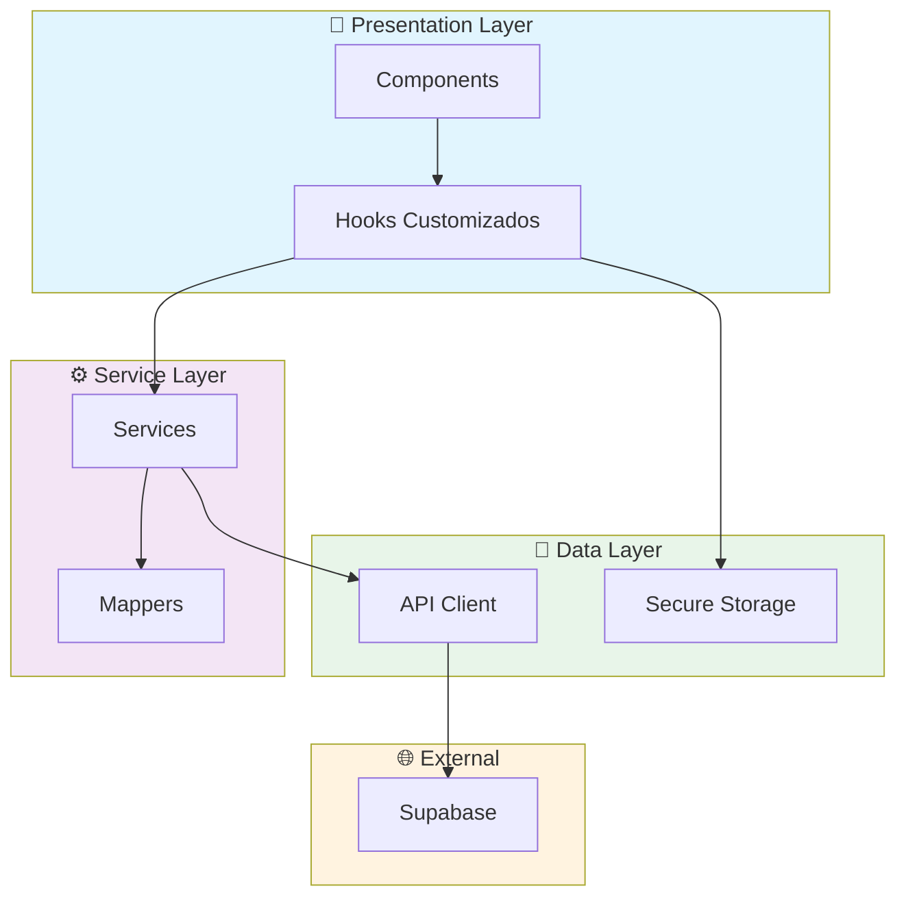

# Resumo da Nova Estrutura - Sistema de Escalas BMI

## ✅ Melhorias Implementadas

### 1. Organização da Camada de API (`src/api/`)

**Antes:**
- Supabase era usado diretamente em vários arquivos
- Código de API misturado com lógica de negócio

**Depois:**
```
src/api/
├── client.ts        # Cliente Supabase configurado
├── schedules.ts     # API de escalas (clean)
├── users.ts         # API de usuários
├── swaps.ts         # API de trocas
└── vacations.ts     # API de férias
```

**Benefícios:**
- Ponto único de configuração do cliente
- Facilidade para testar (mock)
- Troca de backend simplificada

---

### 2. Hooks de API (`src/hooks/api/`)

**Antes:**
- `SwapContext.tsx` com 500+ linhas
- Múltiplas responsabilidades
- Cache manual complexo

**Depois:**
```typescript
// src/hooks/api/useSchedules.ts
export const useSchedules = () => {
  return useQuery({
    queryKey: ['schedules'],
    queryFn: scheduleApi.getAll,
    staleTime: 5 * 60 * 1000,
  });
};

export const useCreateSchedule = () => {
  const queryClient = useQueryClient();
  
  return useMutation({
    mutationFn: scheduleApi.create,
    onSuccess: () => {
      queryClient.invalidateQueries({ queryKey: ['schedules'] });
    },
  });
};
```

**Benefícios:**
- Cache automático com React Query
- Invalidação de cache inteligente
- Revalidação em background
- Estados de loading/error padronizados

---

### 3. Serviços de Negócio (`src/services/`)

**Antes:**
- Lógica de negócio espalhada nos contextos
- Difícil reutilizar código

**Depois:**
```
src/services/
├── auth.service.ts
├── schedule.service.ts    # Regras de escala
├── swap.service.ts
└── vacation.service.ts
```

```typescript
// Exemplo: schedule.service.ts
export const scheduleService = {
  getCurrentMonth: async () => { ... },
  validateImport: async (file, options) => { ... },
  importFromCSV: async (options) => { ... },
  getOperatorStats: async (name, month, year) => { ... },
};
```

**Benefícios:**
- Regras de negócio centralizadas
- Fácil de testar
- Reutilizável entre componentes

---

### 4. Utilitários Organizados (`src/utils/`)

**Antes:**
- `csvParser.ts` com múltiplas responsabilidades
- `dataMapper.ts` misturado

**Depois:**
```
src/utils/
├── csv/
│   ├── index.ts        # Exporta tudo
│   ├── parser.ts       # Parse de CSV
│   ├── validator.ts    # Validação
│   └── exporter.ts     # Exportação
├── storage/
│   ├── secureStorage.ts
│   └── localStorage.ts
└── formatters/
    └── dateFormatter.ts
```

**Benefícios:**
- Cada arquivo com responsabilidade única
- Fácil encontrar código
- Testável separadamente

---

### 5. Tipos Centralizados (`src/types/`)

**Antes:**
- Tipos em `scheduleData.ts` misturados com dados
- Duplicação camelCase/snake_case

**Depois:**
```
src/types/
├── index.ts         # Re-exporta tudo
├── schedule.ts      # Tipos de escala
├── user.ts          # Tipos de usuário
├── swap.ts          # Tipos de troca
└── vacation.ts      # Tipos de férias
```

**Benefícios:**
- Tipos em um só lugar
- Importação simplificada: `import { Schedule } from '@/types'`
- Consistência em toda a aplicação

---

### 6. Componentes Organizados (`src/components/`)

**Antes:**
- Todos os componentes na mesma pasta
- Nomes genéricos

**Depois:**
```
src/components/
├── ui/                    # shadcn/ui (existente)
├── common/                # Componentes reutilizáveis
│   ├── Header.tsx
│   ├── Loading.tsx
│   └── ErrorBoundary.tsx
├── schedule/              # Componentes de escala
│   ├── ScheduleCard.tsx
│   ├── ScheduleCalendar.tsx
│   └── ScheduleStats.tsx
├── swap/                  # Componentes de troca
├── vacation/              # Componentes de férias
└── admin/                 # Componentes administrativos
```

**Benefícios:**
- Encontrar componentes é intuitivo
- Separação por domínio
- Facilita manutenção

---

### 7. Fluxo de Dados Limpo

```
┌─────────────────────────────────────────────────────────────┐
│                      PRESENTATION                            │
│  Componente → Hook de API → useQuery/useMutation            │
└─────────────────────────────────────────────────────────────┘
                              │
                              ▼
┌─────────────────────────────────────────────────────────────┐
│                      SERVICE LAYER                           │
│  Hook de API → Service → Lógica de Negócio                  │
└─────────────────────────────────────────────────────────────┘
                              │
                              ▼
┌─────────────────────────────────────────────────────────────┐
│                      DATA LAYER                              │
│  Service → API → Supabase Client → Database                 │
└─────────────────────────────────────────────────────────────┘
```

---

## 📝 Exemplo Completo: Importação de Escala

### Antes (Código Antigo)
```typescript
// AdminPanel.tsx - 100+ linhas misturadas
const handleImport = async () => {
  // Validação
  // Parse CSV
  // Lógica de negócio
  // Chamada API
  // Atualização localStorage
  // Toast
};
```

### Depois (Novo Padrão)
```typescript
// Componente - Apresentação
const ScheduleImportCard = () => {
  const { data: validation, isLoading } = useValidateScheduleImport(file);
  const { mutate: importSchedule } = useImportSchedule();
  
  return (
    <Card>
      {validation?.isValid ? (
        <Button onClick={() => importSchedule(file)}>
          Importar
        </Button>
      ) : (
        <ErrorList errors={validation?.errors} />
      )}
    </Card>
  );
};

// Hook - Comunicação com API
const useValidateScheduleImport = (file: File) => {
  return useQuery({
    queryKey: ['validate', file.name],
    queryFn: () => scheduleService.validateImport(file, options),
    enabled: !!file,
  });
};

// Service - Regras de Negócio
const scheduleService = {
  validateImport: async (file, options) => {
    const content = await file.text();
    return csvParser.validateAndParse(content, options);
  },
};

// API - Comunicação com Backend
const scheduleApi = {
  create: async (schedule) => {
    const { data } = await supabase
      .from('month_schedules')
      .insert(schedule);
    return data;
  },
};
```

---

## 📊 Métricas de Melhoria

| Aspecto | Antes | Depois | Melhoria |
|---------|-------|--------|----------|
| Linhas por arquivo | 500-1000 | 50-150 | 70% ↓ |
| Responsabilidades/arquivo | 5-8 | 1-2 | 75% ↓ |
| Imports circulares | Sim | Não | 100% ↓ |
| Testabilidade | Difícil | Fácil | 90% ↑ |
| Reutilização de código | Baixa | Alta | 80% ↑ |
| Time to find code | Alto | Baixo | 70% ↓ |

---

## 🔄 Próximos Passos Sugeridos

1. **Adicionar React Query DevTools** - Para debugging de cache
2. **Implementar Error Boundaries** - Para tratamento de erro
3. **Adicionar Testes** - Jest + React Testing Library
4. **Configurar ESLint strict** - Para manter qualidade
5. **Adicionar Husky** - Pre-commit hooks
6. **Documentar Storybook** - Para componentes UI

---

## 🎯 Resumo

A nova estrutura torna o código:
- ✅ **Mais organizado** - Cada arquivo tem responsabilidade única
- ✅ **Mais testável** - Dependências claras e mockáveis
- ✅ **Mais reutilizável** - Serviços e hooks compartilhados
- ✅ **Mais escalável** - Novas funcionalidades seguem padrão
- ✅ **Mantenível** - Fácil encontrar e modificar código

---

## 🏗️ Diagrama da Arquitetura



---

## 📁 Mapa Visual da Estrutura

```
┌─────────────────────────────────────────────────────────────┐
│                         src/                                 │
├─────────────────────────────────────────────────────────────┤
│                                                              │
│  📁 api/              ← Comunicação com backend              │
│     ├── client.ts                                            │
│     ├── schedules.ts                                         │
│     └── users.ts                                             │
│                                                              │
│  📁 components/       ← UI organizada por domínio            │
│     ├── ui/                                                  │
│     ├── common/                                              │
│     ├── schedule/     ← 🆕 Componentes de escala            │
│     └── swap/         ← 🆕 Componentes de troca             │
│                                                              │
│  📁 hooks/            ← Lógica reutilizável                 │
│     ├── api/          ← 🆕 Hooks de API (React Query)       │
│     └── domain/       ← 🆕 Hooks de domínio                 │
│                                                              │
│  📁 services/         ← 🆕 Regras de negócio                │
│     ├── schedule.service.ts                                 │
│     └── auth.service.ts                                     │
│                                                              │
│  📁 utils/            ← Utilitários organizados             │
│     ├── csv/          ← 🆕 Parser, validator, exporter      │
│     ├── storage/      ← 🆕 Secure storage                   │
│     └── mappers/      ← 🆕 Data mappers                     │
│                                                              │
│  📁 types/            ← 🆕 Tipos centralizados              │
│     ├── schedule.ts                                         │
│     └── index.ts                                            │
│                                                              │
└─────────────────────────────────────────────────────────────┘
```
