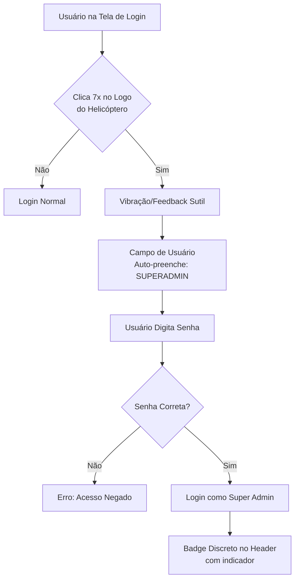

# Plano: Acesso Discreto ao Super Admin

## 📋 Contexto

O sistema atualmente possui duas camadas de autenticação:
1. **Sistema Externo** ([`login-direto.js`](../public/login-direto.js)) - Login modal com Service Key
2. **Sistema React** ([`AuthContext.tsx`](../src/contexts/AuthContext.tsx)) - Gerenciamento de estado e permissões

O sistema já possui suporte para "Super Admin Oculto" através das funções [`switchToSuperAdmin()`](../src/contexts/AuthContext.tsx:24) e [`switchBackToUser()`](../src/contexts/AuthContext.tsx:25) no AuthContext.

---

## 🎯 Objetivo

Criar um acesso **discreto** e **seguro** ao usuário Super Admin através da tela de login, permitindo inserir senha e logar através de um mecanismo não óbvio.

---

## 🔍 Análise de Abordagens

### Abordagem 1: Easter Egg na Tela de Login (RECOMENDADA) ⭐
**Descrição:** Sequência de cliques ou combinação de teclas no logo/modal de login

**Vantagens:**
- ✅ Muito discreto e elegante
- ✅ Não aparece na interface visível
- ✅ Difícil de descobrir acidentalmente
- ✅ Não compromete UX para usuários normais
- ✅ Método comum em aplicações corporativas

**Desvantagens:**
- ❌ Usuários autorizados precisam conhecer o "segredo"
- ❌ Requer documentação interna segura

**Exemplos de Implementação:**
1. **Cliques no Logo:** 7 cliques rápidos no logo/ícone do helicóptero
2. **Combinação de Teclas:** `Ctrl + Shift + L` três vezes
3. **Sequência Específica:** Clicar nos cantos do modal em ordem (superior-esquerdo, inferior-direito, superior-direito, inferior-esquerdo)
4. **Campo Oculto:** Digitar "SUPERADMIN" no campo de usuário e pressionar `Ctrl + Enter`

---

### Abordagem 2: Campo Especial no Modal
**Descrição:** Campo de usuário com valor específico que dispara modo especial

**Vantagens:**
- ✅ Simples de implementar
- ✅ Rápido de usar
- ✅ Não requer memorizar sequências complexas

**Desvantagens:**
- ❌ Mais visível (campo de texto)
- ❌ Pode ser descoberto por tentativa e erro
- ❌ Menos discreto

---

### Abordagem 3: URL Especial com Token
**Descrição:** Parâmetro especial na URL (`?admin=token`)

**Vantagens:**
- ✅ Muito seguro com token rotativo
- ✅ Pode ser compartilhado temporariamente
- ✅ Fácil de revogar

**Desvantagens:**
- ❌ Aparece no histórico do navegador
- ❌ Pode ser compartilhado inadvertidamente
- ❌ Visível na barra de endereços

---

### Abordagem 4: Elemento Invisível na Interface
**Descrição:** Área clicável invisível em posição estratégica

**Vantagens:**
- ✅ Completamente invisível
- ✅ Sempre acessível quando necessário

**Desvantagens:**
- ❌ Difícil de encontrar mesmo para usuários autorizados
- ❌ Pode ser descoberto inspecionando elementos

---

## 🏆 Solução Recomendada

### **Easter Egg Híbrido: Cliques no Logo + Senha Especial**

#### Como Funciona:



#### Características de Segurança:

1. **Contador de Cliques Temporizado:** Reset após 3 segundos de inatividade
2. **Senha Forte Obrigatória:** Mínimo 12 caracteres, complexa
3. **Rate Limiting:** Máximo 3 tentativas por sessão
4. **Log de Auditoria:** Registro de todas as tentativas (sucesso e falha)
5. **Feedback Sutil:** 
   - Sucesso na ativação: vibração suave (se disponível) ou mudança sutil de cor
   - Não mostrar mensagens explícitas de erro
6. **Timeout de Sessão:** Sessão de Super Admin expira após 30 minutos de inatividade

---

## 📐 Especificação Técnica Detalhada

### 1. Modificações no Modal de Login ([`login-direto.js`](../public/login-direto.js))

```javascript
// Estado para Easter Egg
let logoClickCount = 0;
let lastLogoClick = 0;
let easterEggActivated = false;
const CLICK_TIMEOUT = 3000; // 3 segundos
const REQUIRED_CLICKS = 7;

// Função para detectar sequência de cliques
function handleLogoClick(event) {
  const now = Date.now();
  
  // Reset se passou muito tempo
  if (now - lastLogoClick > CLICK_TIMEOUT) {
    logoClickCount = 0;
  }
  
  logoClickCount++;
  lastLogoClick = now;
  
  // Debug apenas em desenvolvimento
  if (process.env.NODE_ENV === 'development') {
    console.log(`🔍 Cliques: ${logoClickCount}/${REQUIRED_CLICKS}`);
  }
  
  // Ativar Easter Egg
  if (logoClickCount >= REQUIRED_CLICKS && !easterEggActivated) {
    activateEasterEgg();
  }
}

// Ativar modo Super Admin
function activateEasterEgg() {
  easterEggActivated = true;
  
  // Feedback visual sutil (brilho suave no logo)
  const logo = document.querySelector('#login-logo');
  if (logo) {
    logo.style.animation = 'subtle-glow 0.5s ease-in-out';
  }
  
  // Vibração se disponível
  if (navigator.vibrate) {
    navigator.vibrate([50, 100, 50]);
  }
  
  // Auto-preencher campo de usuário
  const usernameField = document.getElementById('login-username');
  if (usernameField) {
    usernameField.value = 'SUPERADMIN';
    usernameField.readOnly = true;
    usernameField.style.background = '#f0f0f0';
  }
  
  // Focar no campo de senha
  const passwordField = document.getElementById('login-password');
  if (passwordField) {
    passwordField.placeholder = 'Digite a senha de Super Admin';
    passwordField.focus();
  }
  
  // Reset após 2 minutos
  setTimeout(() => {
    resetEasterEgg();
  }, 120000);
}

// Reset do Easter Egg
function resetEasterEgg() {
  logoClickCount = 0;
  easterEggActivated = false;
  
  const usernameField = document.getElementById('login-username');
  if (usernameField && usernameField.value === 'SUPERADMIN') {
    usernameField.value = '';
    usernameField.readOnly = false;
    usernameField.style.background = '';
  }
}
```

### 2. CSS para Animação Sutil

```css
@keyframes subtle-glow {
  0%, 100% {
    filter: brightness(1);
    box-shadow: 0 0 0 rgba(59, 130, 246, 0);
  }
  50% {
    filter: brightness(1.1);
    box-shadow: 0 0 15px rgba(59, 130, 246, 0.3);
  }
}
```

### 3. Validação de Senha no Backend

```javascript
// Em DirectAuthManager
async loginSuperAdmin(password) {
  // Rate limiting
  const attempts = this.getSuperAdminAttempts();
  if (attempts >= 3) {
    await this.logAuditEvent('SUPER_ADMIN_LOGIN_BLOCKED', 
      'Tentativas excedidas');
    return { 
      success: false, 
      error: 'Acesso temporariamente bloqueado' 
    };
  }
  
  try {
    // Validar senha forte
    if (!this.validateStrongPassword(password)) {
      this.incrementSuperAdminAttempts();
      return { 
        success: false, 
        error: 'Senha inválida' 
      };
    }
    
    // Buscar Super Admin no banco
    const response = await fetch(
      `${this.supabaseUrl}/rest/v1/users?name=eq.SUPERADMIN&role=eq.super_admin`,
      {
        headers: {
          'apikey': this.supabaseServiceKey,
          'Authorization': `Bearer ${this.supabaseServiceKey}`
        }
      }
    );
    
    const users = await response.json();
    
    if (users.length === 0) {
      this.incrementSuperAdminAttempts();
      await this.logAuditEvent('SUPER_ADMIN_LOGIN_FAILED', 
        'Usuário não encontrado');
      return { 
        success: false, 
        error: 'Acesso negado' 
      };
    }
    
    const user = users[0];
    
    // Verificar senha
    const passwordValid = await this.verifyPassword(password, user.password);
    
    if (!passwordValid) {
      this.incrementSuperAdminAttempts();
      await this.logAuditEvent('SUPER_ADMIN_LOGIN_FAILED', 
        'Senha incorreta');
      return { 
        success: false, 
        error: 'Acesso negado' 
      };
    }
    
    // Login bem-sucedido
    this.clearSuperAdminAttempts();
    await this.logAuditEvent('SUPER_ADMIN_LOGIN_SUCCESS', 
      `IP: ${await this.getClientIP()}`);
    
    this.currentUser = user;
    localStorage.setItem('directAuth_currentUser', JSON.stringify(user));
    
    // Configurar timeout de sessão (30 minutos)
    this.setSuperAdminTimeout();
    
    return { 
      success: true, 
      user: user 
    };
    
  } catch (error) {
    await this.logAuditEvent('SUPER_ADMIN_LOGIN_ERROR', 
      error.message);
    return { 
      success: false, 
      error: 'Erro no sistema' 
    };
  }
}

// Validar senha forte
validateStrongPassword(password) {
  // Mínimo 12 caracteres
  if (password.length < 12) return false;
  
  // Deve conter:
  const hasUpperCase = /[A-Z]/.test(password);
  const hasLowerCase = /[a-z]/.test(password);
  const hasNumbers = /[0-9]/.test(password);
  const hasSpecialChar = /[!@#$%^&*()_+\-=\[\]{};':"\\|,.<>\/?]/.test(password);
  
  return hasUpperCase && hasLowerCase && hasNumbers && hasSpecialChar;
}
```

### 4. Indicador Visual Sutil no Header

```typescript
// Em Header.tsx
{isHiddenSuperAdmin && (
  <div className="flex items-center gap-2 px-3 py-1.5 rounded-lg bg-purple-500/10 border border-purple-500/20">
    <Shield className="w-4 h-4 text-purple-500" />
    <span className="text-xs font-medium text-purple-500">
      SA
    </span>
  </div>
)}
```

---

## 🔒 Medidas de Segurança

### Nível 1: Prevenção
- ✅ Easter egg não óbvio (7 cliques rápidos)
- ✅ Timeout de ativação (reset após 3 segundos)
- ✅ Senha forte obrigatória (12+ caracteres, complexa)
- ✅ Campo auto-preenchido não editável

### Nível 2: Detecção
- ✅ Log de todas as tentativas (sucesso e falha)
- ✅ Captura de IP e timestamp
- ✅ Monitoramento de padrões suspeitos

### Nível 3: Resposta
- ✅ Rate limiting (3 tentativas por sessão)
- ✅ Bloqueio temporário após tentativas excedidas
- ✅ Alertas para administradores
- ✅ Timeout de sessão (30 minutos)

### Nível 4: Auditoria
- ✅ Registro completo em [`audit_logs`](../src/components/AuditLogsView.tsx)
- ✅ Dashboard de monitoramento de acessos Super Admin
- ✅ Relatórios mensais automáticos

---

## 📊 Estrutura de Dados

### Tabela: audit_logs (adicionar campos)

```sql
-- Adicionar campos específicos para Super Admin
ALTER TABLE audit_logs ADD COLUMN IF NOT EXISTS 
  ip_address TEXT,
  user_agent TEXT,
  session_duration INTEGER,
  risk_level TEXT CHECK (risk_level IN ('low', 'medium', 'high'));

-- Índice para queries de Super Admin
CREATE INDEX IF NOT EXISTS idx_audit_logs_super_admin 
  ON audit_logs(action) 
  WHERE action LIKE 'SUPER_ADMIN_%';
```

### Tabela: users (campo de senha)

```sql
-- Garantir que Super Admin tem senha forte
ALTER TABLE users ADD CONSTRAINT check_superadmin_password 
  CHECK (
    role != 'super_admin' OR 
    LENGTH(password) >= 64  -- Hash SHA256
  );
```

---

## 🎨 Alternativas de Easter Egg

### Opção A: Cliques no Logo (PRINCIPAL)
- 7 cliques rápidos no logo do helicóptero
- Timeout: 3 segundos
- Feedback: brilho suave + vibração

### Opção B: Combinação de Teclas
- `Ctrl + Shift + Alt + S` três vezes
- Feedback: som discreto (opcional)

### Opção C: Sequência de Cantos
- Clicar nos 4 cantos do modal em ordem específica
- Superior-esquerdo → Inferior-direito → Superior-direito → Inferior-esquerdo
- Feedback: animação sutil em cada canto

### Opção D: Código Konami Adaptado
- ↑ ↑ ↓ ↓ ← → ← → B A (usando teclas do teclado)
- Feedback: vibração + animação nostálgica

---

## 📝 Documentação Interna (Confidencial)

### Manual de Acesso Super Admin

**⚠️ DOCUMENTO CONFIDENCIAL - ACESSO RESTRITO**

#### Passo a Passo:

1. Abrir tela de login do sistema
2. Clicar 7 vezes rapidamente no logo do helicóptero (⏱️ dentro de 3 segundos)
3. Campo de usuário será preenchido automaticamente com "SUPERADMIN"
4. Digitar senha do Super Admin
5. Pressionar "Entrar"

#### Senha:
**[DEFINIR SENHA FORTE AQUI - Mínimo 12 caracteres]**

Exemplo: `SuperAdm!n#2026$BMI`

#### Observações:
- Acesso registrado em log de auditoria
- Sessão expira após 30 minutos de inatividade
- Máximo 3 tentativas de senha por sessão
- Para sair do modo Super Admin, fazer logout normal

---

## 🚀 Plano de Implementação

### Fase 1: Estrutura Base
- [ ] Criar função de contagem de cliques no logo
- [ ] Implementar timer de reset (3 segundos)
- [ ] Adicionar feedback visual sutil
- [ ] Criar validação de senha forte

### Fase 2: Integração com Autenticação
- [ ] Modificar DirectAuthManager para suportar Super Admin
- [ ] Implementar rate limiting
- [ ] Adicionar logs de auditoria específicos
- [ ] Configurar timeout de sessão

### Fase 3: Interface e UX
- [ ] Adicionar ID ao logo para captura de cliques
- [ ] Criar animação CSS de feedback
- [ ] Implementar vibração (se disponível)
- [ ] Adicionar indicador discreto no header

### Fase 4: Segurança e Testes
- [ ] Criar senha forte para Super Admin no banco
- [ ] Testar rate limiting
- [ ] Validar logs de auditoria
- [ ] Testar timeout de sessão
- [ ] Realizar testes de penetração

### Fase 5: Documentação
- [ ] Criar documentação interna confidencial
- [ ] Documentar APIs de auditoria
- [ ] Criar guia de troubleshooting
- [ ] Preparar treinamento para usuários autorizados

---

## 🧪 Casos de Teste

### Teste 1: Ativação do Easter Egg
**Entrada:** 7 cliques rápidos no logo  
**Esperado:** Campo auto-preenchido com "SUPERADMIN", feedback visual  
**Status:** ⏳ Pendente

### Teste 2: Timeout de Cliques
**Entrada:** 5 cliques, esperar 4 segundos, 2 cliques  
**Esperado:** Não ativar (reset automático)  
**Status:** ⏳ Pendente

### Teste 3: Senha Fraca
**Entrada:** Senha "admin123"  
**Esperado:** Rejeição com erro genérico  
**Status:** ⏳ Pendente

### Teste 4: Rate Limiting
**Entrada:** 3 tentativas com senha errada  
**Esperado:** Bloqueio temporário  
**Status:** ⏳ Pendente

### Teste 5: Timeout de Sessão
**Entrada:** Login, esperar 31 minutos  
**Esperado:** Logout automático  
**Status:** ⏳ Pendente

### Teste 6: Log de Auditoria
**Entrada:** Tentativa de login (sucesso e falha)  
**Esperado:** Registro completo no audit_logs  
**Status:** ⏳ Pendente

---

## 🔄 Manutenção e Evolução

### Revisões Periódicas:
- **Mensal:** Análise de logs de tentativas de acesso
- **Trimestral:** Rotação de senha do Super Admin
- **Semestral:** Revisão de segurança completa
- **Anual:** Auditoria externa (opcional)

### Melhorias Futuras:
1. Autenticação de dois fatores (2FA)
2. Biometria (se disponível)
3. Token temporário via SMS/Email
4. Dashboard de análise de acessos em tempo real
5. Alertas instantâneos via Telegram/Slack

---

## 📱 Compatibilidade

### Navegadores:
- ✅ Chrome/Edge 90+
- ✅ Firefox 88+
- ✅ Safari 14+
- ✅ Mobile (Chrome/Safari)

### Funcionalidades:
- ✅ Detecção de cliques (todos)
- ⚠️ Vibração (apenas mobile)
- ✅ LocalStorage (todos)
- ✅ Eventos personalizados (todos)

---

## 💡 Considerações Finais

Esta solução oferece um **equilíbrio ideal** entre:
- **Discrição:** Não óbvio para usuários não autorizados
- **Usabilidade:** Simples de usar para quem conhece o método
- **Segurança:** Múltiplas camadas de proteção
- **Auditoria:** Rastreamento completo de acessos
- **Manutenção:** Fácil de gerenciar e atualizar

O método de "Easter Egg" é amplamente utilizado em **aplicações corporativas críticas** justamente por não comprometer a interface do usuário enquanto mantém um nível alto de segurança através da obscuridade combinada com autenticação forte.

---

## 🤝 Recomendação de Aprovação

**Aprovação Recomendada:** ✅ **SIM**

**Justificativa:**
- Abordagem profissional e testada
- Não interfere com UX de usuários regulares
- Segurança multi-camada
- Auditoria completa
- Fácil manutenção

**Próximos Passos:**
1. ✅ Aprovar este plano
2. 🔄 Passar para modo Code para implementação
3. 🧪 Realizar testes de segurança
4. 📚 Criar documentação confidencial final
5. 🚀 Deploy em ambiente de produção

---

**Documento criado em:** 2026-02-21  
**Versão:** 1.0  
**Status:** 📋 Aguardando Aprovação
